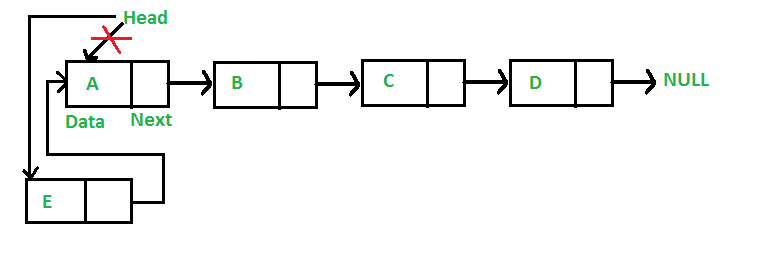
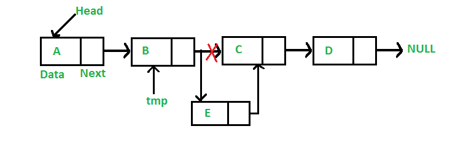
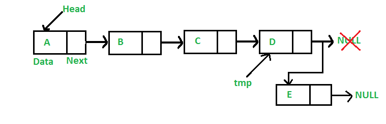

### Insertion

### Complexity Analysis:

| Operation              | Complexity                                            |
| ---------------------- | ----------------------------------------------------- |
| Insertion at beginning | O(1)                                                  |
| Insertion at end       | O(1) if pointer to end node is given else O(n)        |
| Insertion in middle    | O(1) if pointer to the target_node is given else O(n) |

### Insertion at the beginning : To insert at the beginning of the list, we need to change next pointer of new node as head and previous pointer of head node as new node.



#### Algorithm:

1. Allocate memory for new node.
2. Put data in the new node.
3. Make next of new node as head and previous as NULL.
4. Change previous of head node to new node.
5. Move the head to point to the new node.

```cpp
// Function to insert a new node at the
// beginning of Linked List

void push(Node** head_ref, int new_data)
{
    /* 1. allocate node */
    Node* new_node = new Node();

    /* 2. put in the data */
    new_node->data = new_data;

    /* 3. Make next of new node as head */
    new_node->next = (*head_ref);

    /* 4. move the head to point to the new node */
    (*head_ref) = new_node;
}
```

### Insertion after a given node : We are given pointer to a node, and the new node is inserted after the given node.



#### Algorithm:

1. Check if the given prev_node is NULL.
2. Allocate memory for new_node.
3. Put in the data.
4. Make next of new_node as next of prev_node.
5. Make next of prev_node as new_node.

```cpp
// Function to insert a new node after a given node

void insertAfter(Node* prev_node, int new_data)
{
    /*1. check if the given prev_node is NULL */
    if (prev_node == NULL) {
        cout << "The given previous node cannot be NULL";
        return;
    }

    /* 2. allocate new node */
    Node* new_node = new Node();

    /* 3. put in the data */
    new_node->data = new_data;

    /* 4. Make next of new node as next of prev_node */
    new_node->next = prev_node->next;

    /* 5. move the next of prev_node as new_node */
    prev_node->next = new_node;
}
```

### Insertion at the end : Since a Linked List is typically represented by the head of it, we have to traverse the list till end and then change the next of last node to new node.



#### Algorithm:

1. Allocate memory for new_node.
2. Put in the data.
3. This new node is going to be the last node, so make next of it as NULL.
4. If the Linked List is empty, then make the new node as head.
5. Else traverse till the last node.
6. Change the next of last node.
7. Return the new node.

```cpp
// Function to insert a new node at the end

void append(Node** head_ref, int new_data)
{
    /* 1. allocate node */
    Node* new_node = new Node();

    Node* last = *head_ref; /* used in step 5*/

    /* 2. put in the data */
    new_node->data = new_data;

    /* 3. This new node is going to be
    the last node, so make next of
    it as NULL*/
    new_node->next = NULL;

    /* 4. If the Linked List is empty,
    then make the new node as head */
    if (*head_ref == NULL) {
        *head_ref = new_node;
        return;
    }

    /* 5. Else traverse till the last node */
    while (last->next != NULL)
        last = last->next;

    /* 6. Change the next of last node */
    last->next = new_node;
    return;
}
```
