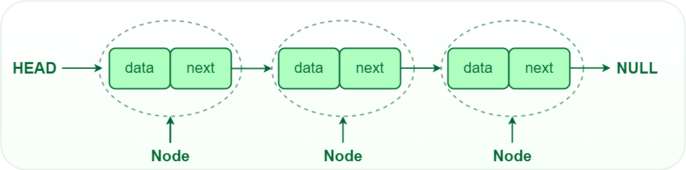
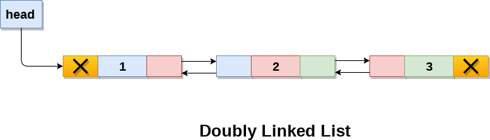
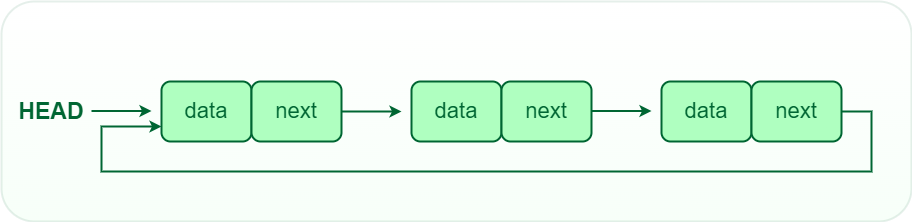

View using Ctrl+K V

# **Linked list** is a linear data structure where in elements are not stored at contiguous memory locations.A Linked List is dynamic in nature that is it can grow/shrink at runtime by allocating and deallocating memory.The elements in a linked list are linked using pointers as shown in the below image:



# Node Structure- Each node in a linked list consists of at least two parts:

### 1.**Data Part**:which contains the actual data to be stored in the node.

### 2. **Pointer (Or Reference)**: to the next node in the sequence.

### 3. **Head** : The linked list is accessed through the head node, which points to the first node in the list. If the list is empty, then the head is a null reference.

### 4. **Tail** : The last node in the list points to NULL or nullptr, indicating the end of the list. This node is known as the tail node.

# **Advantages of Linked List over arrays**:

### 1. **Dynamic size** : Linked list is a dynamic data structure so it can grow and shrink at runtime by allocating and deallocating memory. So there is no need to give initial size of linked list.

### 2. **Insertion and Deletion** : Insertion and deletion of nodes are really easier. Unlike array here we don’t have to shift elements after insertion or deletion of an element. In linked list we just have to update the address present in next pointer of a node.

### 3.**Efficient Memory Utilization** : As size of linked list can increase or decrease at run time so there is no memory wastage. In case of array there is lot of memory wastage, like if we declare an array of size 10 and store only 6 elements in it then space of 4 elements are wasted. There is no such problem in linked list as memory is allocated only when required.

### 4. Implementation : Data structures such as stack and queues can be easily implemented using linked list.

# **Disadvantages of Linked List**:

### 1. **Random access is not allowed**. We have to access elements sequentially starting from the first node.

### 2. **Extra memory space for a pointer** is required with each element of the list.

# **Types of Linked List**:

### 1. **Singly Linked List** : In this type of linked list, every node stores address or reference of next node in list and the last node has next address or reference as NULL.Also known as **Unidirectional Linked List** or **One way chain**.


### 2. **Doubly Linked List** : In this type of linked list, every node stores address or reference of next as well as previous node in list.The first node of the list has prevous address/refernce as NULL and similarly the last node of list has next address or reference as NULL. Also known as **Bidirectional Linked List** or **Two way chain**.



### 3. **Circular Linked List** : Circular linked list is a linked list where all nodes are connected to form a circle. The last node of the list contains a pointer to the first node of the List. A circular linked list can be a singly circular linked list or doubly circular linked list.



# Representation of Single linked list:

```cpp
// A linked list node

struct Node
{
    int data;
    struct Node *next;
};
```

# **Basic Operations on Linked List**:

### 1. **Traversal** : To traverse all the nodes of a linked list and print their data.

### 2. **Insertion** : To add a node at the beginning, at the end or at any position in the linked list.

### 3. **Searching** : To search an element in the linked list.

### 4. **Deletion** : To delete a node from the linked list.

### 5. **Sorting** : To sort the elements of the linked list.

### 6. **Merging** : To merge two linked lists into one.

### 7. **Reversing** : To reverse the elements of the linked list.

### 8. **Concatenation** : To concatenate two linked lists into one.

### 9. **Splitting** : To split a linked list into two halves.

### 10. **Circularizing** : To make a linked list circular.
